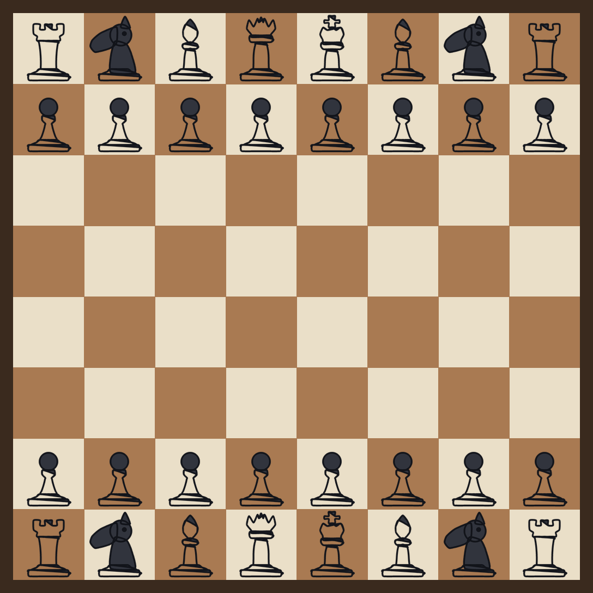

# Catur Online

Catur multiplayer di browser. Main bareng teman pakai kode room, ngobrol lewat
obrolan suara, dan kalau koneksimu kepental kamu bisa masuk lagi tanpa mengulang
apa pun.

Ini penerus dari project Uno-game lama. Sistemnya dibangun ulang, bukan ditempel.



## Yang bisa dilakukan

**Mabar.** Buat room, bagikan kode 6 karakter atau tautannya, temanmu langsung masuk.
Bisa juga cari lawan acak atau langsung main lawan bot.

**Ngobrol pakai suara.** Ada tombol gabung suara di lobby dan di meja. Setelah
diizinkan sekali, kamu dan temanmu bicara langsung. Tidak ada server media yang
dilewati, jadi tidak ada biaya per menit dan tidak ada rekaman yang disimpan.
Indikator bicara menyala di avatar orang yang sedang ngomong.

**Ngobrol teks.** Riwayat obrolan disimpan di server, jadi kalau kamu sempat
terputus dan masuk lagi, isi obrolannya masih ada. Tiap langkah juga dicatat
otomatis di log yang sama.

**Kepental? Sambung lagi.** Ini yang paling beda dari project lama. Kalau
koneksimu putus, kursimu tidak dilepas. Server menahan kursi itu selama 2 menit,
dan jam catumu ikut berhenti dulu 60 detik supaya kamu tidak kalah cuma karena
WiFi-nya nge-drop. Begitu kamu buka lagi halamannya, kamu duduk kembali di kursi
yang sama, papan, riwayat langkah, dan jam semuanya utuh. Tidak perlu isi nama
lagi, tidak perlu minta kode room lagi.

**Penonton.** Kursi pemain cuma dua, tapi teman lain tetap bisa masuk sebagai
penonton. Mereka lihat papannya dan ikut di obrolan suara.

**Aturan catur lengkap.** Rokade, en passant, promosi, skak, skakmat, buntu,
aturan 50 langkah, pengulangan posisi tiga kali, dan seri karena materi tidak
cukup. Semuanya divalidasi di server.

## Fitur di meja

- Jam catur dengan pilihan kontrol waktu: 3+2, 5+0, 10+0, 10+5, 30+0, atau tanpa batas.
- Warna bisa ditentukan host atau diacak.
- Tawaran seri, menyerah, dan main lagi dengan warna ditukar.
- Bidak bisa digeser dengan drag atau cukup diketuk dua kali.
- Petunjuk langkah yang sah, penanda langkah terakhir, dan penanda raja yang di-skak.
- Bidak yang sudah dimakan tampil di bawah nama pemain.
- Bot yang berpikir sendiri. Bisa cari skakmat satu langkah dan tidak membuang ratu sembarangan.

## Cara jalanin

```bash
npm install
npm run dev      # http://localhost:8787
npm run deploy   # naik ke Cloudflare
```

Buka `http://localhost:8787`, isi nama, pilih avatar, lalu **Main Lawan Bot**
kalau mau langsung coba. Untuk tes berdua, buka dua jendela browser dan klik
**Buat Room Mabar** di salah satunya.

Obrolan suara butuh HTTPS atau `localhost`. Di `localhost` sudah aman, di
produksi Cloudflare sudah otomatis HTTPS.

## Struktur

```
client/
  index.html          tampilan semua layar
  style.css           seluruh gaya tampilan
  app.js              koneksi, sambung ulang, layar, obrolan
  board.js            gambar papan, animasi bidak, drag dan ketuk
  voice.js            WebRTC obrolan suara antar pemain
  rules.js            aturan catur, dipakai server dan browser
  assets/pieces/      12 bidak SVG
  assets/avatars/     14 avatar SVG + fallback
server/
  index.js            Worker, LobbyDO, RoomDO
  bot.js              mesin bot
tools/
  generate_pieces.py  generator bidak
  generate_avatars.py generator avatar
  render_preview.py   render pratinjau papan
tests/
  perft.mjs           uji aturan catur
  bot.mjs             uji bot
  e2e.mjs             uji server lewat WebSocket sungguhan
docs/
wrangler.toml
```

`client/rules.js` sengaja ditaruh di folder client karena dipakai dua-duanya:
server mengimpornya untuk memutuskan langkah sah, browser mengimpornya untuk
menyalakan petunjuk langkah. Jadi aturannya cuma ada satu salinan, tidak mungkin
beda antara tampilan dan server.

## Kenapa arsitekturnya begini

Di project Uno lama, semua room dipegang satu Durable Object global dan state-nya
cuma hidup di memori. Dua akibatnya kelihatan: kalau isolate-nya didaur ulang,
semua game putus, dan refresh berarti keluar dari room karena tidak ada cara
mengenali pemain yang kembali.

Di sini dua hal itu dibalik:

**Satu Durable Object per room.** Worker mengarahkan `/ws?room=KODE` ke DO milik
room itu sendiri lewat `idFromName`. Jadi tidak ada satu titik yang menampung
semua orang, dan room yang ramai tidak mengganggu room lain. Lobby punya DO
sendiri khusus untuk antrean matchmaking.

**State disimpan, bukan cuma diingat.** Isi room ditulis ke storage Durable
Object setiap kali berubah. Kalau DO-nya mati atau di-deploy ulang, room-nya
hidup lagi lengkap dengan papan, jam, dan riwayat obrolan. Yang hilang cuma
koneksi WebSocket-nya, dan itu justru yang disambung ulang otomatis oleh klien.

**Setiap kursi punya token.** Waktu kamu masuk, server membuat token acak 32
karakter dan menyimpannya di `localStorage` bersamamu. Token itu yang dipakai
untuk duduk kembali. Nama dan avatar saja tidak cukup karena bisa ditiru orang
lain; token tidak bisa.

**Jam dihitung dari waktu absolut.** Server mengirim batas waktu berakhirnya jam
dalam bentuk timestamp, bukan angka sisa detik. Jadi tampilan jam di browser
tidak melenceng walau koneksinya lambat, dan tidak perlu ada pesan penyegar tiap
detik.

**Timer tidak memakai setTimeout.** Semua tenggat (jam habis, masa tenggang
habis, bot mau melangkah) dijadwalkan lewat alarm Durable Object. Alarm itu
disimpan, jadi tetap jalan walaupun prosesnya sempat berhenti.

## Aturan sambung ulang

| Kejadian | Yang terjadi |
|---|---|
| Koneksi putus saat main | Kursi ditahan 2 menit, jam kamu berhenti dulu 60 detik |
| Buka lagi halamannya | Otomatis duduk kembali, papan dan jam utuh |
| Refresh halaman | Sama seperti di atas, tidak perlu isi nama |
| Lawan putus | Kamu dapat pemberitahuan, papannya tetap terbuka |
| Masa tenggang habis saat main | Kursinya ditandai ditinggalkan, kamu boleh lanjut lawan bot |
| Masa tenggang habis di lobby | Kursinya dilepas, host dialihkan kalau dia yang pergi |
| Keluar sendiri saat main | Dianggap kalah, seperti menyerah |

Tombol **Sambung ulang** juga muncul di menu utama kalau kamu masih punya kursi
yang tertinggal dari sesi sebelumnya.

## Protokol pesan

Semua lewat satu WebSocket. Lobby di `/ws`, room di `/ws?room=KODE`.

### Klien ke server

| Tipe | Isi | Keterangan |
|---|---|---|
| `FIND_MATCH` | `playerId`, `profile`, `timeControlId` | Masuk antrean matchmaking |
| `CANCEL_MATCH` | | Keluar dari antrean |
| `CREATE_ROOM` | `playerId`, `profile`, `timeControlId`, `hostColor` | Buat room, pengirim jadi host |
| `JOIN` | `playerId`, `profile` | Masuk room. Kursi penuh atau game jalan berarti jadi penonton |
| `RESUME` | `playerId`, `token` | Duduk kembali di kursi lama |
| `SET_OPTIONS` | `timeControlId`, `hostColor` | Khusus host, hanya di lobby |
| `ADD_BOT` / `REMOVE_BOT` | `memberId` | Khusus host, hanya di lobby |
| `START_GAME` | | Khusus host, butuh dua pemain |
| `MOVE` | `from`, `to`, `promotion` | Langkah biasa |
| `RESIGN` | | Menyerah |
| `OFFER_DRAW` / `DRAW_ACCEPT` / `DRAW_DECLINE` | | Tawaran seri |
| `REMATCH` | | Minta ulang, warna ditukar |
| `BACK_TO_LOBBY` | | Khusus host, setelah permainan selesai |
| `TAKE_OVER_BOT` | `memberId` | Ubah pemain yang pergi jadi bot |
| `CHAT_SEND` | `text` | Obrolan teks, dipotong 280 karakter |
| `VOICE_JOIN` / `VOICE_LEAVE` / `VOICE_MUTE` | `muted` | Status obrolan suara |
| `VOICE_SIGNAL` | `to`, `kind`, `payload` | Sinyal WebRTC, diteruskan ke pemain tujuan |
| `LEAVE_ROOM` | | Keluar |
| `PING` | | Jaga koneksi |

`profile` = `{ name, avatar, avatarUrl }`. `avatarUrl` cuma diterima kalau
host-nya ada di daftar putih CDN, kalau tidak otomatis jatuh ke avatar bawaan.

### Server ke klien

`READY`, `STATE`, `CHAT_MESSAGE`, `GAME_START`, `GAME_OVER`, `MEMBER_OFFLINE`,
`MEMBER_LEFT`, `VOICE_PEERS`, `VOICE_SIGNAL`, `MATCH_SEARCHING`, `MATCH_FOUND`,
`MATCH_CANCELLED`, `ROOM_CREATED`, `RESUME_FAILED`, `LEFT_ROOM`, `ERROR`, `PONG`.

`STATE` selalu memuat keadaan utuh: daftar anggota, papan, giliran, riwayat
langkah, jam, bidak yang dimakan, dan 40 pesan obrolan terakhir. Klien tidak
pernah menyusun state sendiri dari potongan-potongan pesan.

## Obrolan suara, teknisnya

Tidak ada server media. Yang dilakukan server cuma meneruskan sinyal WebRTC
(`offer`, `answer`, `candidate`) antara pemain di room yang sama. Suaranya
mengalir langsung dari browser ke browser.

- Tiap pasangan pemain punya satu `RTCPeerConnection` sendiri, jadi jumlah
  koneksi bertambah satu setiap ada orang baru gabung suara.
- Penentuan siapa yang menawarkan dipakai perbandingan ID: yang ID-nya lebih
  besar yang mulai. Ini menghindari dua-duanya menawarkan di saat bersamaan.
- Pakai STUN publik Google dan Twilio. Tidak ada TURN, jadi kalau dua pemain
  berada di balik NAT yang ketat, suaranya bisa gagal tersambung walaupun
  permainannya tetap jalan. Menambah TURN sendiri cukup dengan mengubah `ICE`
  di `client/voice.js`.
- Indikator bicara dihitung di browser pakai `AnalyserNode`, bukan dikirim ke
  server.

## Bot

Negamax dengan alpha-beta, dilengkapi pencarian senyap untuk pertukaran bidak
dan tabel posisi untuk tiap jenis bidak. Kedalaman naik bertahap sampai 4 ply
selama masih di dalam jatah waktu 700 ms. Langkah diurutkan dulu supaya
pemangkasan alpha-beta lebih banyak kena.

Bot jalan di dalam Durable Object, bukan di browser, jadi pemain tidak bisa
membaca langkah yang akan datang dari kode di halamannya.

## Aset

Semua digambar sendiri, bukan hasil model gambar. Regenerate kapan saja:

```bash
npm run assets     # bidak dan avatar sekaligus
npm run pieces
npm run avatars
python3 tools/render_preview.py docs/preview-game.png
```

Butuh Pillow (`pip install Pillow`). Bidak ditulis sebagai satu daftar titik
untuk tiap bagian, lalu dihaluskan jadi kurva dan dikeluarkan sebagai SVG. Karena
SVG, bidaknya tetap tajam di layar apa pun dan ukurannya kecil.

## Tes

```bash
npm test           # aturan catur dan bot
npm run test:e2e   # butuh server dev yang jalan
```

| Berkas | Isi |
|---|---|
| `tests/perft.mjs` | Perft 6 posisi standar sampai kedalaman 4, ditambah skakmat, buntu, pengulangan, 50 langkah, dan materi tidak cukup |
| `tests/bot.mjs` | Bot menemukan skakmat satu langkah, merebut ratu menggantung, dan 12 permainan penuh tanpa langkah tidak sah |
| `tests/e2e.mjs` | Dua klien sungguhan: matchmaking, langkah, skakmat, obrolan, sinyal suara, main lagi, putus lalu sambung ulang, token palsu, penonton, dan menyerah |

Perft itu uji wajib untuk mesin catur. Kalau angkanya meleset satu pun, berarti
ada aturan yang salah dan seluruh hasil bot jadi tidak bisa dipercaya.

## Catatan

- Bidak dan avatar dibuat deterministik, jadi hasilnya sama setiap kali dijalankan.
- Satu room menampung 2 pemain dan penonton tanpa batas praktis.
- Tidak ada peringkat, tidak ada akun, tidak ada database pemain. Semua identitas
  cuma hidup di `localStorage` masing-masing browser.
- Kalau mau dipakai ramai, yang perlu ditambah cuma TURN server untuk obrolan
  suara. Sisanya sudah terpisah per room.

## Lisensi

MIT.
